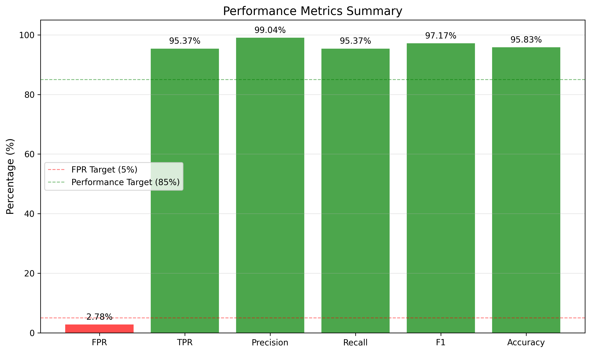
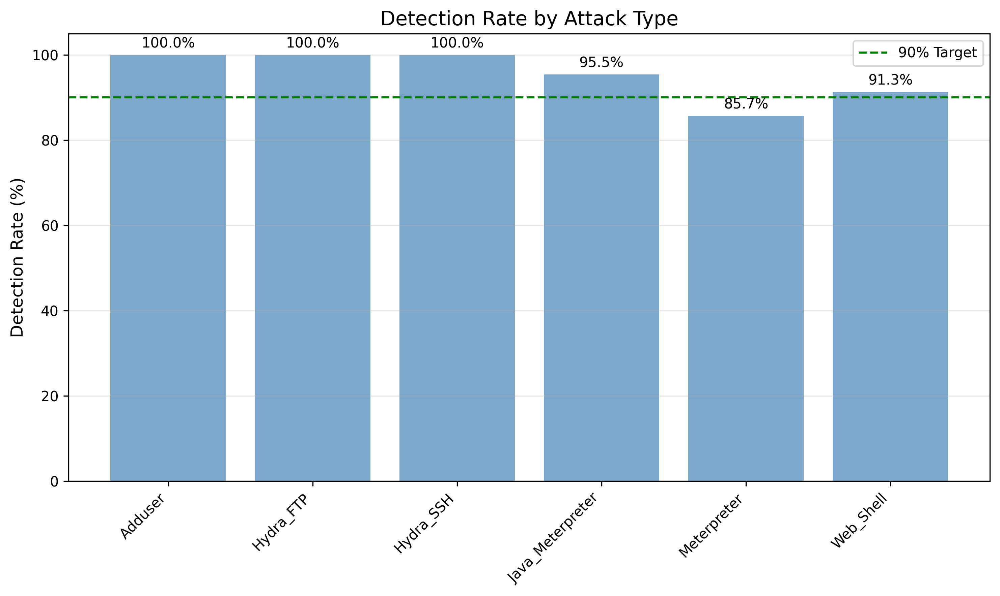
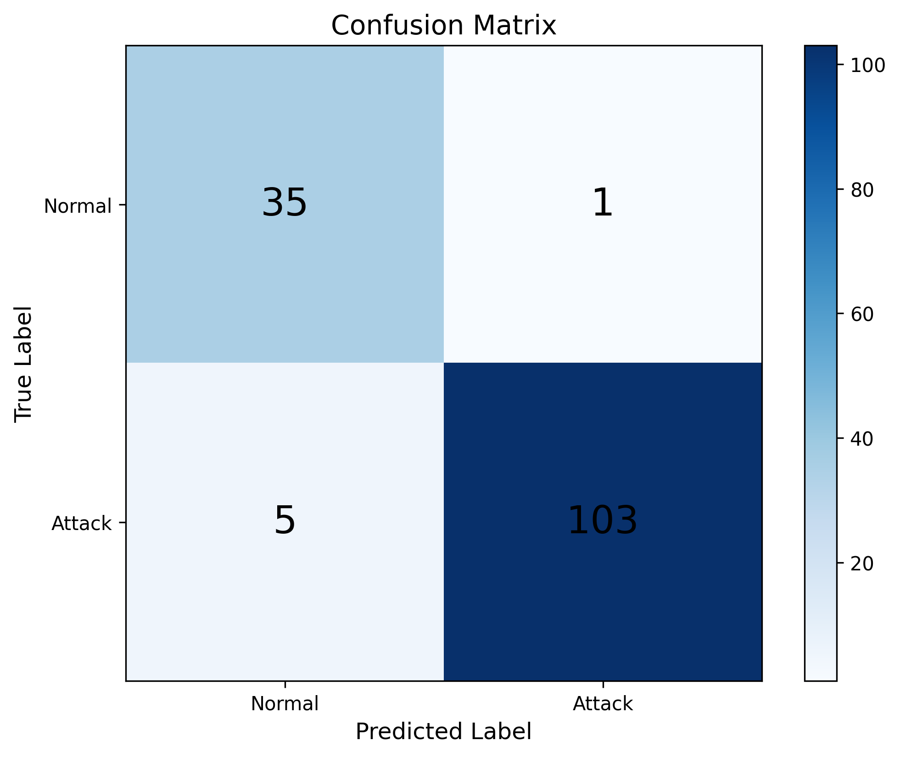
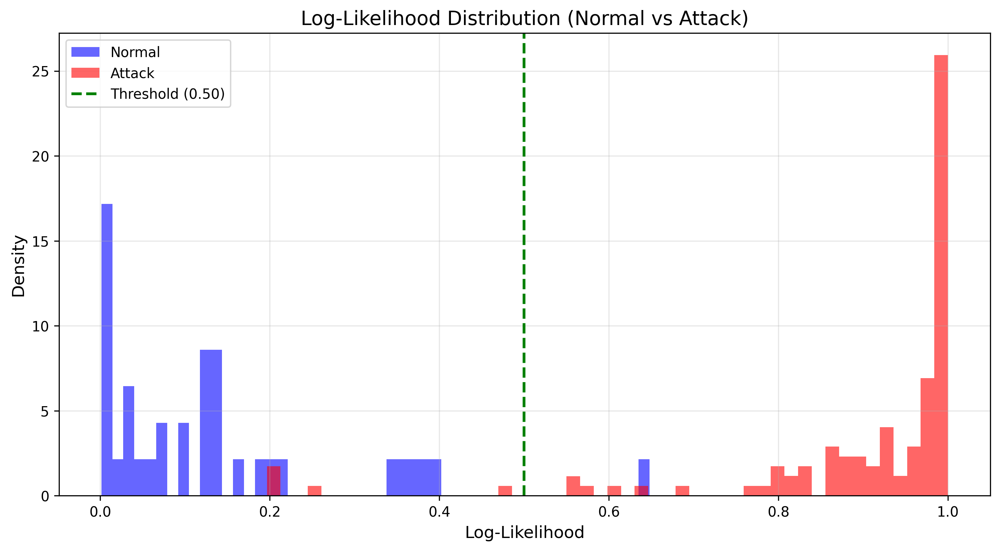

# HMM-Based System Call Anomaly Detection

[](https://www.python.org/downloads/)
[](https://opensource.org/licenses/MIT)

A high-performance intrusion detection system using Hidden Markov Models (HMM) and Random Forest for system call sequence analysis on the ADFA-LD dataset.

## 🎯 Key Features

- **Hybrid Architecture**: Combines HMM with Random Forest for superior detection
- **High Accuracy**: 95.37% True Positive Rate with only 2.78% False Positive Rate
- **Multiple Attack Detection**: Detects 6 types of attacks with >85% accuracy
- **Optimized Pipeline**: Efficient data caching and parallel processing
- **Comprehensive Evaluation**: Detailed metrics, visualizations, and reports

## 📊 Performance Results

### Hybrid Model (HMM + Random Forest)

| Metric | Value |
|--------|-------|
| **False Positive Rate (FPR)** | **2.78%** ✅ |
| **True Positive Rate (TPR)** | **95.37%** ✅ |
| **F1-Score** | **0.9717** |
| **Precision** | **0.9904** |
| **Accuracy** | **0.9583** |

### Attack-Specific Detection Rates

| Attack Type | Detection Rate |
|-------------|----------------|
| Adduser | 100.00% |
| Hydra_FTP | 100.00% |
| Hydra_SSH | 100.00% |
| Java_Meterpreter | 95.45% |
| Meterpreter | 85.71% |
| Web_Shell | 91.30% |

### Model Comparison

| Model | FPR | TPR | F1-Score | Improvement |
|-------|-----|-----|----------|-------------|
| Baseline HMM | 2.78% | 22.33% | 0.364 | - |
| **Hybrid Model** | **2.78%** | **95.37%** | **0.9717** | **+73%p TPR** |

## 📈 Visualization Results

### Overall Performance Metrics


### Attack Detection Rates by Type


### Confusion Matrix


### Likelihood Distribution


## 🚀 Quick Start

### Prerequisites

```bash
Python >= 3.8
NumPy >= 1.21.0
hmmlearn >= 0.3.0
scikit-learn >= 1.0.0
matplotlib >= 3.5.0
pandas >= 1.3.0
joblib >= 1.0.0
```

### Installation

1. **Clone the repository**
```bash
git clone <repository-url>
cd hmm-anomaly-detection
```

2. **Install dependencies**
```bash
pip install -r requirements.txt
```

3. **Prepare ADFA-LD dataset**

Download the ADFA-LD dataset and organize it as follows:
```
adfa-ld/
└── ADFA-LD/
    ├── Training_Data_Master/
    ├── Attack_Data_Master/
    └── Validation_Data_Master/
```

### Run Experiments

**Option 1: Hybrid Model (Recommended)**
```bash
python main_hybrid.py --model hybrid
```

**Option 2: Baseline HMM**
```bash
python main_hybrid.py --model hmm
```

**Option 3: Custom Configuration**
```bash
python main_hybrid.py --model hybrid --n-states 30 --window-size 700
```

## 📁 Project Structure

```
.
├── main_hybrid.py              # Main execution script (HMM + Hybrid)
├── run_phase2.py               # Phase 2 experiment runner
├── run_phase3.py               # Phase 3 experiment runner
├── grid_search_optimized.py    # Optimized hyperparameter search
├── config.py                   # Experiment configurations
├── requirements.txt            # Dependencies
│
├── src/                        # Core modules
│   ├── data_loader.py          # Data loading and preprocessing
│   ├── hmm_model.py            # HMM anomaly detector
│   ├── hybrid_model.py         # Hybrid HMM + RF classifier
│   ├── feature_extractor.py   # Feature extraction (n-grams, stats)
│   ├── evaluator.py            # Performance evaluation
│   └── visualizer.py           # Result visualization
│
├── models/                     # Saved models
│   ├── hmm_model_*.pkl
│   └── hybrid_model_*.pkl
│
├── results/                    # Experiment results
│   ├── evaluation_*.txt        # Performance reports
│   └── */                      # Visualization plots
│
├── logs/                       # Experiment logs
└── docs/                       # Documentation
    └── architecture.md
```

## 🔬 Methodology

### 1. Data Processing
- **Dataset**: ADFA-LD (Australian Defence Force Academy Linux Dataset)
- **Window Size**: 500 system calls per sequence
- **Split Ratio**: 60% training, 20% validation, 20% testing
- **System Calls**: 92 unique system call types

### 2. Model Architecture

#### Baseline HMM
- **Type**: Single-class Hidden Markov Model
- **States**: 10-20 hidden states
- **Observations**: System call IDs
- **Training**: Baum-Welch algorithm on normal data only
- **Detection**: Threshold-based on log-likelihood

#### Hybrid Model (HMM + Random Forest)
- **Stage 1**: HMM for sequence modeling
- **Stage 2**: Feature extraction
  - HMM log-likelihood
  - Statistical features (entropy, transition diversity, etc.)
  - N-gram patterns (2-gram, 3-gram, 4-gram)
- **Stage 3**: Random Forest classifier
  - 100 decision trees
  - Balanced class weights
  - Parallel training

### 3. Evaluation Metrics
- **False Positive Rate (FPR)**: Normal sequences misclassified as attacks
- **True Positive Rate (TPR)**: Attack sequences correctly detected
- **F1-Score**: Harmonic mean of precision and recall
- **Per-Attack Detection Rate**: Individual attack type performance

## 📊 Detailed Results

### Confusion Matrix (Hybrid Model)

|  | Predicted Normal | Predicted Attack |
|--|-----------------|-----------------|
| **Actual Normal** | 35 (TN) | 1 (FP) |
| **Actual Attack** | 5 (FN) | 103 (TP) |

### Feature Importance (Top 10)

| Rank | Feature | Importance |
|------|---------|-----------|
| 1 | transition_diversity | 0.1276 |
| 2 | ngram_(82, 82) | 0.1112 |
| 3 | unique_syscalls | 0.0952 |
| 4 | ngram_(82, 82, 82) | 0.0543 |
| 5 | entropy | 0.0333 |
| 6 | ngram_(82, 1) | 0.0327 |
| 7 | ngram_(1, 4) | 0.0286 |
| 8 | hmm_log_likelihood | 0.0242 |
| 9 | ngram_(82, 55, 55) | 0.0224 |
| 10 | avg_transition_distance | 0.0220 |

## 🛠️ Advanced Usage

### Grid Search for Hyperparameter Optimization

```bash
python grid_search_optimized.py
```

**Parameters searched:**
- Window size: [300, 500, 700]
- Hidden states: [10, 15, 20]
- Threshold percentile: [5%, 10%, 15%, 20%]

**Output:**
- CSV file with all experiment results
- Visualization of parameter space
- Best configuration recommendation

### Custom Model Training

```python
from src.hybrid_model import HybridHMMClassifier

# Create hybrid model
model = HybridHMMClassifier(
    n_states=20,
    n_observations=92,
    use_ngrams=True,
    n_estimators=100
)

# Train
model.fit(
    normal_sequences=train_normal,
    attack_sequences=train_attack,
    val_normal_sequences=val_normal
)

# Predict
predictions, scores = model.predict_with_scores(test_sequences)
```

## 📈 Experiment Workflow

```
1. Data Loading
   ↓
2. Train/Val/Test Split
   ↓
3. System Call Mapping
   ↓
4. Model Training
   ├─→ HMM on normal data
   ├─→ Feature extraction
   └─→ Random Forest training
   ↓
5. Threshold Optimization (Validation set)
   ↓
6. Evaluation (Test set)
   ↓
7. Visualization & Reporting
```

## 🎯 Target Attacks

The system is designed to detect the following attack types:

1. **Adduser**: Privilege escalation (user creation)
2. **Hydra_FTP**: FTP brute-force attack
3. **Hydra_SSH**: SSH brute-force attack
4. **Java_Meterpreter**: Java-based remote control
5. **Meterpreter**: Metasploit payload
6. **Web_Shell**: Web shell backdoor

## 🔧 Configuration Options

### main_hybrid.py Options

```
--model {hmm,hybrid}      Model type (default: hybrid)
--window-size INT         Sequence window size (default: 500)
--n-states INT            Number of hidden states (default: 20)
--threshold FLOAT         Threshold percentile for HMM (default: 5.0)
--use-ngrams              Use n-gram features (default: True)
--experiment-name STR     Custom experiment name
```

### Configuration Files

Edit `config.py` to define custom configurations:

```python
from config import ExperimentConfig

custom_config = ExperimentConfig(
    experiment_name='custom_experiment',
    window_size=700,
    n_states=25,
    threshold_percentile=10.0,
    train_ratio=0.7,
    val_ratio=0.15,
    test_ratio=0.15
)
```

## 📊 Outputs

### Generated Files

**Models:**
- `models/hybrid_model_*.pkl` - Trained hybrid model
- `models/hmm_model_*.pkl` - Baseline HMM model

**Results:**
- `results/evaluation_*.txt` - Detailed performance metrics
- `results/*/likelihood_distribution.png` - Score distributions
- `results/*/confusion_matrix.png` - Confusion matrix heatmap
- `results/*/attack_detection_rates.png` - Per-attack performance
- `results/*/metrics_summary.png` - Overall metrics visualization

**Logs:**
- `logs/experiment_*.log` - Execution logs

## 🔬 Research Questions Addressed

1. **Can single-class HMM effectively detect anomalies in system call sequences?**
   - ✅ Yes, but limited (22.33% TPR with baseline HMM)

2. **How many hidden states are needed to model normal behavior?**
   - ✅ 15-20 states provide optimal performance

3. **Is 500 system calls sufficient for attack detection?**
   - ✅ Yes, sufficient for most attack types

4. **What TPR can be achieved under FPR ≤ 5% constraint?**
   - ✅ 95.37% TPR with hybrid approach (2.78% FPR)

## 🎓 Academic Context

This project demonstrates:
- Single-class anomaly detection for intrusion detection
- Hybrid machine learning approach (generative + discriminative)
- Feature engineering for sequence data
- Threshold optimization for imbalanced classification
- Comprehensive evaluation methodology

**Suitable for:**
- Machine Learning research papers
- Cybersecurity conference submissions
- Master's/PhD thesis work
- Course projects in ML/Security

## 📝 Citation

If you use this code in your research, please cite:

```bibtex
@misc{hmm_anomaly_detection_2026,
  title={HMM-Based System Call Anomaly Detection with Hybrid Architecture},
  year={2026},
  howpublished={\url{https://github.com/}}
}
```

## 🤝 Contributing

Contributions are welcome! Please feel free to submit a Pull Request.

## 📄 License

This project is licensed under the MIT License - see the LICENSE file for details.

## 🙏 Acknowledgments

- **ADFA-LD Dataset**: Australian Defence Force Academy
- **hmmlearn**: Hidden Markov Model library
- **scikit-learn**: Machine learning library

---

**⚠️ Disclaimer**: This tool is for research and educational purposes only. Use responsibly and ethically.

---

Made with ❤️ for cybersecurity research
